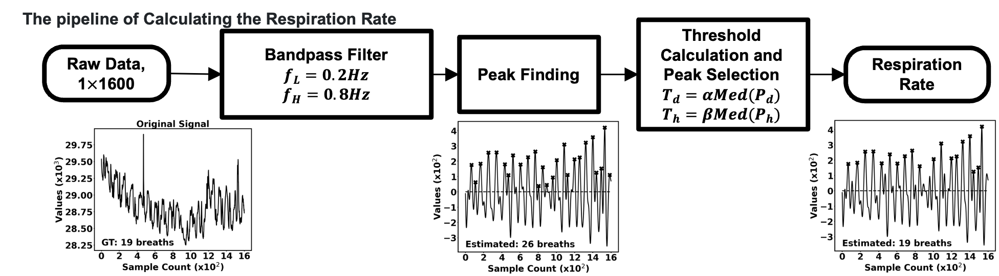
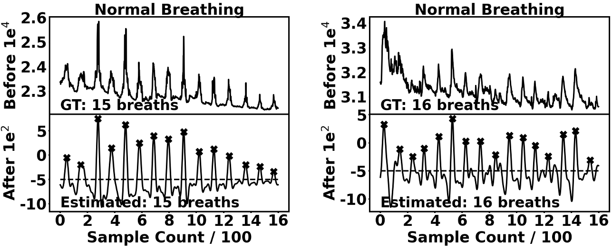
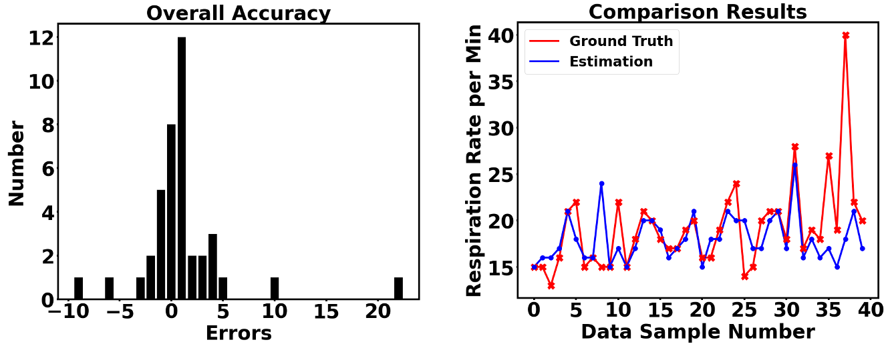

# RespirationRateCalculation

## Introduction

This repo is official implementation of paper **Soft, Skin-Interfaced Multimodal Sensing Systems with Artificial Intelligence for Continuous Monitoring of COVID-19 Symptoms** for calculating the respiration rate. 

<p align="center">

</p>

**What this repo provides:**
* **Python** implementation of the respiration rate calculation.
* Flexible and simple code using **python Jupyter Notebook**.
* Results **visulization code** in paper format.

## Dependencies
* [NumPy](https://numpy.org/)
* [matplotlib](https://matplotlib.org/)
* [scipy](https://scipy.org/)
* [Anaconda](https://www.anaconda.com/)
* [Jupyter Notebook](https://jupyter.org/)

This code is tested under Ubuntu 16.04, Anaconda environment with Jupyter Notebook.

Python 3.6.5 version with Anaconda 3 is used for development.

## Directory

### Root
The `${RespirationRateCalculation}` is described as below.
```
${RespirationRateCalculation}
|-- data
|-- respiration_rate_calculation.ipynb
|-- visualization_for_paperwriting.ipynb
```
* `data` contains 4 volunteers, and each volunteer contains 40 sequences
* `respiration_rate_calculation.ipynb` used for calculate the respiration rate and visualize the location of the respiration.
* `visualization_for_paperwriting.ipynb` visualize the final result in paper format.
  
### Data
Please download the dataset in this **[Link](https://drive.google.com/file/d/1ix3B3JSplSp7fisazam-z7pNxlM7tyVL/view?usp=sharing)**. 

You need to upzip the dataset and follow directory structure of the `data` as below.
```
${CoughingClassificationTask}
|-- data
|   |-- 001
|   |   |-- 001-15.csv
|   |   |-- 002-15.csv
|   |   |-- 003-13.csv
`
`
|   |-- 002
|   |   |-- 001-22.csv
|   |   |-- 002-15.csv
|
`
`
|   |-- 004
`
`
|   |   |-- 009-22.csv
|   |   |-- 010-20.csv
```

**Note:** The number before '.csv' is the ground truth of the sequence. For example, the ground truth of file ***001-15.csv*** is 15 breath/min. 

If you have a problem with 'Download' problem when tried to download dataset from google drive link, please try this trick.  
```  
* Go the shared folder, which contains files you want to copy to your drive  
* Select all the files you want to copy  
* In the upper right corner click on three vertical dots and select “make a copy”  
* Then, the file is copied to your personal google drive account. You can download it from your personal account.  
```  

## Respiration Rate Calculation
* Because the calculation is based on the FFT and Bandpass filter. We can directly perform the respiration calculation in the Jupyter Notebook. 

### Start
* In the file `respiration_rate_calculation.ipynb`, you can simplely run the calculation progress by clicking the Excute Cell. 
* We used the Jupyter Notebook for better visualizing the progress of the calculation. It is easier for debugging the code.  

### Test
* Configure the parameters by setting up the following lines:
    ```python3
    high_pass = 0.2     # Highpass filter 
    low_pass = 0.8      # Lowpass filter
    height_thr = 0.15   # Height threshold
    distance_thr = 0.15 # Distance threshold
   ```
* Run Excute Cell directly, then the results will present as follow
  <p align="center">
  
  </p>
* The results can also present in paper format by running the `visualization_for_paperwriting.ipynb`.
    

## Results
* The overall performance can be visulize in two perspectives, including the histogram format and the line format. 
  <p align="center">
  
  </p>
